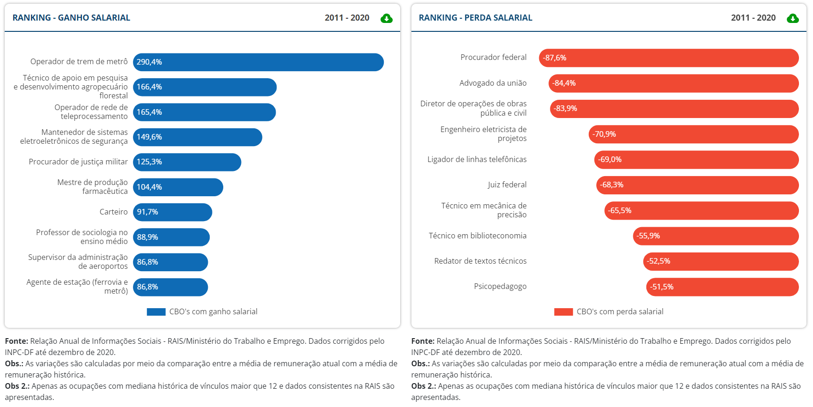
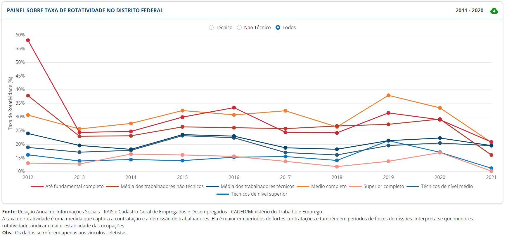

# Monitor do Mercado de Trabalho - MMT

## Página inicial

**Texto antigo:**

O Monitor do Mercado de Trabalho do Distrito Federal - MMT foi uma iniciativa da Secretaria do Trabalho e Emprego do Distrito Federal, por meio da Diretoria de Monitoramento e Articulação de Oportunidades de Trabalho, desenvolvida pela Codeplan (atual IPEDF Codeplan) em 2017. Já em 2021, a remodelagem da plataforma digital integrou o Projeto Panorama da Capacitação do Distrito Federal como um produto da pesquisa, de forma a incluir as informações do mercado de trabalho relacionadas ao ensino profissional técnico.

O MMT tem como objetivo ser um instrumento de consulta sobre os principais dados da temática do trabalho e emprego do Distrito Federal de forma eficiente, simples e acessível. Esta proposta consiste em fornecer consultas e análises instantâneas, dinâmicas e interativas sobre o mercado de trabalho do Distrito Federal, resultado de um compilado de variáveis de bases definidas sobre a temática. Desta forma, este instrumento possibilita contribuir para o planejamento e elaboração de políticas públicas baseadas em evidência na área do mercado de trabalho local. Além dos painéis interativos, a ferramenta disponibiliza o download dos dados para que os usuários possam realizar suas próprias análises.

O monitor fornece, atualmente, informações sobre remuneração, vínculos de trabalho e rotatividade de trabalhadores. E existem planos para a expansão da ferramenta para fornecer também dados demográficos dos trabalhadores, análises das empresas contratantes e das ocupações, da informalidade no Distrito Federal e dados gerais sobre a formação profissional no DF.

**Texto novo:**

O Monitor do Mercado de Trabalho do Distrito Federal - MMT foi uma iniciativa da Secretaria do Trabalho e Emprego do Distrito Federal, por meio da Diretoria de Monitoramento e Articulação de Oportunidades de Trabalho, desenvolvida pelo IPEDF (antiga Codeplan) em 2017. Já em 2021, a remodelagem da plataforma digital integrou o Projeto Panorama da Capacitação do Distrito Federal como um produto da pesquisa, de forma a incluir as informações do mercado de trabalho relacionadas ao ensino profissional técnico.

O MMT tem como objetivo ser um instrumento de consulta instantâneas, dinâmicas e interativas sobre o mercado de trabalho do Distrito Federal, de forma eficiente, simples e acessível. Por isso, o monitor abrange um compilado de diversas variáveis sobe trabalho e emprego. 

Diante disso, o MMT pode ser visto como uma ferramenta que oferece suporte tanto para indivíduos que desejam analisar o mercado de trabalho no qual pretendem se inserir quanto para o governo na formulação de políticas públicas embasadas em evidências na área do mercado de trabalho local. Além dos painéis interativos, a ferramenta disponibiliza o download dos dados para que os usuários possam realizar suas próprias análises.

1. Remuneração e ocupações
   1.1 Ranking de remuneração e vínculos por CBO;
   1.2 Remuneração mediana;
   1.3 Número de vínculos;
   1.4 Taxa de rotatividade.

2. Ocupações técnicas

   2.1 Ocupações por empresas;

   2.2 Empresas par ocupações;

   2.3 Ocupações e eixos tecnológicos.

## Painel 2 - Remunerações e ocupações

**Texto antigo:**

O primeiro painel disponível da versão atualizada do MMT – Remunerações e Ocupações consiste na análise dos dados de remuneração e de emprego no Distrito Federal. Esse painel contribui para visualizar e entender a dinâmica recente do mercado de trabalho local fornecendo quatro agrupamentos de informações: Remunerações por CBO’s, Remuneração Média, Proporção Vínculos e Taxa de Rotatividade.

O painel Remunerações por CBOs trata dos valores salariais em reais de cada ocupação identificada no Distrito Federal. Classificação Brasileira de Ocupações – CBO é o termo utilizado para identificar as profissões do mercado de trabalho brasileiro e, neste painel é apresentado o ranking das profissões com o maior ganho salarial e maior perda salarial e é possível customizar a análise selecionando as profissões – CBOs de interesse do usuário.

O painel Remuneração Média permite a visualização e análise de dados desde 2011 até 2022 sobre a remuneração média por hora trabalhada no Distrito Federal sendo possível filtrar pelo nível de escolaridade dos profissionais. O painel Proporção Vínculos trata da relação de profissionais estatutários e celetistas, também é possível relaciona-los com o nível de escolaridade.

O painel Taxa de Rotatividade permite observar o comportamento da taxa de rotatividade profissional de acordo com o nível de escolaridade do profissional do Distrito Federal. Os dados de remuneração foram corrigidos pela inflação (INPC-DF) até dezembro de 2020, com objetivo de se obter comparações adequadas.

Nos painéis Remuneração média, Proporção Vínculos e Taxa de Rotatividade, é possível filtrar os resultados para os vínculos técnicos (aqueles relacionados com os cursos profissionais técnicos) e não técnicos (outros tipos de vínculos), conforme metodologia definida no estudo Panorama da Capacitação do Distrito Federal.

Ressalte-se que os dados de emprego se referem apenas mercado formal de trabalho. E que vínculo empregatício diz respeito ao contrato de trabalho entre um trabalhador e um empregador. O número de vínculos é sempre maior que o número de trabalhadores, já que um trabalhador pode ter mais de um vínculo empregatício.

Além das pesquisas interativas, o usuário está livre para fazer o download dos dados e realizar suas próprias análises ao clicar nos ícones de nuvem ao lado das visualizações.

**Texto novo:**

O primeiro painel disponível do MMT – Remunerações e Ocupações consiste na análise dos dados de remuneração e de emprego no Distrito Federal. Esse painel contribui para visualizar e entender a dinâmica recente do mercado de trabalho local fornecendo quatro agrupamentos de informações: Remunerações por CBO’s, Remuneração Média, Proporção Vínculos e Taxa de Rotatividade.

O painel Remunerações por CBOs trata dos valores salariais em reais de cada ocupação identificada no Distrito Federal. Classificação Brasileira de Ocupações – CBO é o termo utilizado para identificar as profissões do mercado de trabalho brasileiro e, neste painel é apresentado o ranking das profissões com o maior ganho salarial e maior perda salarial e é possível customizar a análise selecionando as profissões – CBOs de interesse do usuário.

O painel Remuneração Média permite a visualização e análise de dados desde 2011 até 2022 sobre a remuneração média por hora trabalhada no Distrito Federal sendo possível filtrar pelo nível de escolaridade dos profissionais. O painel Proporção Vínculos trata da relação de profissionais estatutários e celetistas, também é possível relaciona-los com o nível de escolaridade.

O painel Taxa de Rotatividade permite observar o comportamento da taxa de rotatividade profissional de acordo com o nível de escolaridade do profissional do Distrito Federal. 

A rotatividade pode ser definida como o movimento recorrente de substituição de parte da força de trabalho utilizada em cada ciclo produtivo anual, através de demissões e admissões de trabalhadores que são realizadas dentro de um país e/ou unidade da federação. Tal movimento de substituição é medido por meio da taxa de rotatividade. 

O método escolhido para realizar o calculo da rotatividade é o fornecido por Silva Filho e Silva (2013): 
$$
R:\frac{\sum(Admitidos_t,Desligados_t)}{\textit{Total da força de trabalho}_t}
$$
Nos painéis Remuneração média, Proporção Vínculos e Taxa de Rotatividade, é possível filtrar os resultados para os vínculos técnicos (aqueles relacionados com os cursos profissionais técnicos) e não técnicos (outros tipos de vínculos), conforme metodologia definida no estudo Panorama da Capacitação do Distrito Federal.

Ressalte-se que os dados de emprego se referem apenas mercado formal de trabalho. E que vínculo empregatício diz respeito ao contrato de trabalho entre um trabalhador e um empregador. O número de vínculos é sempre maior que o número de trabalhadores, já que um trabalhador pode ter mais de um vínculo empregatício.

Além das pesquisas interativas, o usuário está livre para fazer o download dos dados e realizar suas próprias análises ao clicar nos ícones de nuvem ao lado das visualizações.

### Painel 2.1 - Ranking de CBOs

- Retirar o filtro do tipo de vínculo.

- Gráficos de ganho e perda salarial
  - trocar período para 2012 - 2021;
  - **fonte**: Dados corrigidos pelo INPC-DF com preços de 2022 como base.
  - **obs.**: As variações são calculadas por meio da comparação entre a mediana de remuneração atual com a mediana do ano anterior.
  - **obs. 2**: Apenas as CBOs que concentram 95% do total dos vínculos são apresentadas.
  
- Gráfico de ganho e perda de vínculos
  - **título**: Ranking - ganho de vínculos;
  - trocar período para 2012 - 2021;
  - **fonte**: Dados corrigidos pelo INPC-DF com preços de 2022 como base.
  - **obs.**: As variações são calculadas por meio da comparação entre o número de vínculos atual com o número de vínculos do ano anterior.
  - **obs. 2**: Apenas as CBOs que concentram 95% do total dos vínculos são apresentadas.

### Painel 2.2 - Remuneração média
- Trocar título do subpainel para *Remuneração mediana*.

- Gráfico de remuneração mediana por hora trabalhada
  - **título**: Remuneração mediana por hora trabalhada;
  - **fonte**: Relação Anual de Informações Sociais - RAIS/Ministério do Trabalho e Emprego. Dados corrigidos pelo INPC-DF com preços de 2022 como base;
- Retirar gráfico de Estatutário.

### Painel 2.3 - Proporção vínculos
- Trocar título para *Número de vínculos*.

- Retirar gráfico da *Evolução da proporção do número de vínculos no DF*.
- Adicionar gráfico de *número absoluto de vínculos* ou *taxa de variação anual do número de vínculos*.
  
  
  - **fonte**: Relação Anual de Informações Sociais - RAIS/Ministério do Trabalho e Emprego. Dados corrigidos pelo INPC-DF com preços de 2022 como base;

### Painel 2.4 - Taxa de rotatividade

- Gráfico da taxa de rotatividade no DF
  - **título**: Taxa de rotatividade no DF;
  - trocar período para 2012 - 2021;
  - **fonte**: Relação Anual de Informações Sociais - RAIS e Cadastro Geral de Empregados e Desempregados - CAGED/Ministério do Trabalho e Emprego. Dados corrigidos pelo INPC-DF com preços de 2022 como base.
  - **obs.**: A taxa de rotatividade é uma medida que captura a contratação e a demissão de trabalhadores. Ela é maior em períodos de fortes contratações e também em períodos de fortes demissões. Interpreta-se que menores rotatividades indicam maior estabilidade das ocupações.
  - **obs. 2**: Os dados se referem apenas aos vínculos celetistas.

## Painel 3 - Ocupações técnicas

**Texto novo**:

O segundo painel do MMT é dedicado às "Ocupações Técnicas", fornece dados detalhados sobre as ocupações contratadas de acordo com o tipo de atividade econômica. Além disso, também apresenta informações sobre as atividades econômicas contratantes, classificadas por tipo de ocupação técnica, no Distrito Federal, abrangendo o período de 2011 a 2021. E, por fim, dados acerca ocupações técnicas do DF por eixo tecnológico Esses dados podem ser facilmente acessados e baixados pelos usuários interessados.

No painel "Ocupações para Empresas", é possível selecionar uma ocupação específica e visualizar um gráfico que apresenta informações relevantes sobre a ocupação escolhida, juntamente com suas atividades correspondentes.

Já no painel "Empresas para Ocupações", é permitido selecionar uma atividade econômica e, a partir disso, analisar um gráfico contendo informações sobre as ocupações relacionadas a essa atividade.

Além disso, o painel "Ocupações e Eixos Tecnológicos" exibe gráficos que demonstram as ocupações técnicas e seus respectivos eixos tecnológicos. É importante destacar que os eixos tecnológicos são elementos fundamentais na estrutura da educação profissional e tecnológica, pois organizam diversos cursos com o objetivo de orientar seus projetos pedagógicos.
